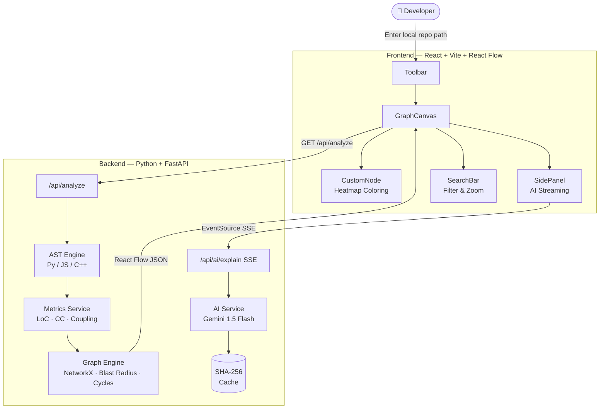

<div align="center">

# 🔍 CodeLens

### AI-Powered Repository Structure Analysis & Visualisation

*Map any codebase in seconds. Understand it in minutes.*

[](https://www.python.org/)
[](https://fastapi.tiangolo.com/)
[](https://react.dev/)
[](https://vitejs.dev/)
[](https://ai.google.dev/)
[](./LICENSE)

---

> **Jumping into a massive, unfamiliar codebase can be overwhelming.**
> CodeLens parses your local Git repositories and builds a **living, interactive knowledge graph** —
> revealing hidden dependencies, flagging high-risk files, and letting AI explain any file instantly.

---

<!-- DEMO GIF PLACEHOLDER — added in Phase 5 -->
<!--  -->

</div>

---

## ✨ Features

| Feature | Description |
|---|---|
| 🧠 **Multi-Language AST Parsing** | Deep static analysis for Python (`ast`), JavaScript/TypeScript (import/require), and C/C++ (`#include`) — no code execution required |
| 🌡️ **Complexity Heatmap** | Node glow colour encodes McCabe Cyclomatic Complexity — see your riskiest files at a glance |
| 💥 **Blast Radius Analysis** | Click any node to instantly highlight every file that would break if it changed — powered by NetworkX reverse graph traversal |
| 🏗️ **3 Live Layout Modes** | Switch between Hierarchical (ELKjs), Force-Directed, and Radial layouts on the fly |
| 🤖 **Streaming AI Insights** | Word-by-word AI explanations via Server-Sent Events (SSE), backed by Google Gemini 1.5 Flash |
| ⚡ **SHA-256 Smart Cache** | AI responses cached by file content hash — zero redundant API calls, instant results for unchanged files |
| 🔍 **Global Search & Filter** | Search nodes by name, filter by file type or complexity band — the graph highlights and zooms automatically |
| 🔄 **Circular Dependency Detection** | Automatically detects and visually flags import cycles with animated edges |

---

## 🏛️ Architecture



---

## 🗂️ Project Structure

```
codelens/
│
├── README.md                   # You are here
├── LICENSE                     # MIT
├── CONTRIBUTING.md             # Contribution guide
├── .gitignore
│
├── backend/                    # Python FastAPI backend
│   ├── main.py                 # App entry point
│   ├── requirements.txt        # Python dependencies
│   ├── .env.example            # Environment variable template
│   ├── routers/
│   │   ├── analyze.py          # GET /api/analyze
│   │   └── ai.py              # GET /api/ai/explain (SSE)
│   ├── services/
│   │   ├── ast_engine.py       # Multi-language AST parser
│   │   ├── metrics.py          # LoC, cyclomatic complexity, coupling
│   │   ├── graph_engine.py     # NetworkX graph, blast radius, cycles
│   │   └── ai_service.py       # Gemini API + SHA-256 cache
│   └── cache/                  # Auto-generated AI response cache
│
├── frontend/                   # React + Vite frontend
│   ├── index.html
│   ├── vite.config.js
│   ├── package.json
│   └── src/
│       ├── App.jsx             # Root layout
│       ├── index.css           # Design system (CSS variables)
│       ├── store/
│       │   └── graphStore.js   # Zustand global state
│       ├── components/
│       │   ├── GraphCanvas.jsx # React Flow canvas
│       │   ├── CustomNode.jsx  # Complexity-heatmap node
│       │   ├── SidePanel.jsx   # Streaming AI panel
│       │   ├── Toolbar.jsx     # Path input, layout toggles, filters
│       │   └── SearchBar.jsx   # Global search
│       ├── hooks/
│       │   ├── useGraphLayout.js  # ELKjs layout (3 modes)
│       │   └── useBlastRadius.js  # Blast radius BFS
│       └── utils/
│           ├── colorUtils.js   # Complexity → colour mapping
│           └── layoutUtils.js  # ELKjs format helpers
│
└── docs/
    ├── architecture.md         # Deep-dive system design
    └── demo.gif                # Demo animation (Phase 5)
```

---

## 🚀 Quick Start

### Prerequisites
- Python 3.11+
- Node.js 18+
- A [Google Gemini API key](https://ai.google.dev/)

### 1. Clone the repository
```bash
git clone https://github.com/your-username/codelens.git
cd codelens
```

### 2. Start the Backend
```bash
cd backend
python -m venv venv
# Windows:
venv\Scripts\activate
# macOS/Linux:
source venv/bin/activate

pip install -r requirements.txt

# Set up your API key
cp .env.example .env
# Edit .env and add your GEMINI_API_KEY

uvicorn main:app --reload --port 8000
```

### 3. Start the Frontend
```bash
cd frontend
npm install
npm run dev
```

### 4. Open in browser
Navigate to **[http://localhost:5173](http://localhost:5173)**, enter any local repository path, and click **Analyse**.

---

## 📡 API Reference

Interactive API docs available at **[http://localhost:8000/docs](http://localhost:8000/docs)** (Swagger UI) when the backend is running.

| Endpoint | Method | Description |
|---|---|---|
| `/api/analyze` | `GET` | Analyse a directory — returns React Flow nodes + edges JSON |
| `/api/ai/explain` | `GET` | Stream AI insight for a file (SSE) |
| `/docs` | `GET` | Swagger UI — interactive API explorer |

---

## 🧪 How It Works: The Intelligence Pipeline

1. **Traverse** — `os.walk()` discovers all source files, respecting common ignore patterns
2. **Parse** — Language-specific AST engines extract import/dependency edges
3. **Measure** — `radon` computes McCabe Cyclomatic Complexity per file; LoC and coupling scored alongside
4. **Graph** — `networkx.DiGraph` models the dependency graph; cycles are detected, blast radius computed via reverse BFS
5. **Render** — ELKjs positions nodes automatically; React Flow renders the interactive canvas
6. **Explain** — Gemini 1.5 Flash streams a plain-English explanation; SHA-256 hash caching avoids redundant API calls

---

## 🤝 Contributing

See [CONTRIBUTING.md](./CONTRIBUTING.md) for guidelines on code style, commit conventions, and how to submit pull requests.

---

## 📄 License

MIT © 2025 GDSC IITR — CodeLens Team

---

<div align="center">

*Built with 🧠 research, ❤️ craft, and a deep respect for developer experience.*

</div>
